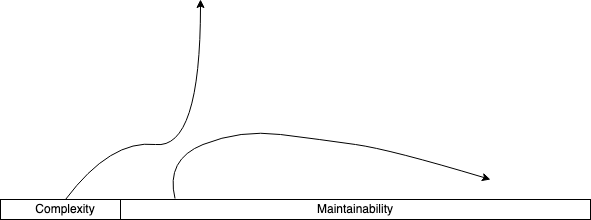
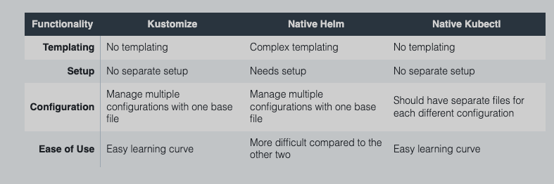

# Why Kustomize? Why Now? 

> Nav: [Back to Intro Lectures](../README.md)

Configuration management is hard!.
As software complexity increases, ease of maintainability decreases.

One of the challenges of working with Kubernetes is the need to manage and maintain multiple configurations for different environments, such as development, staging, and production. Manually managing these configurations can be time-consuming and error-prone, particularly as the number of configurations and the complexity of the deployment increases.

Kustomize helps to address this challenge by providing a way to customize and manage Kubernetes configurations in a declarative and reusable way. Instead of writing and maintaining separate configuration files for each environment, Kustomize allows you to define a base configuration and then apply overlays to customize it for different environments.

For example, you can use Kustomize to define a base configuration for a set of microservices and then apply overlays to customize the configuration for different environments. You can also use Kustomize to manage common configurations, such as secrets and certificates, in a centralized way, making it easier to maintain and update them as needed.

In addition to its configuration management capabilities, Kustomize also makes it easy to manage and deploy container images. You can use Kustomize to specify the images to be used for different components of your deployment, and it will handle the process of pulling and deploying the images as part of the overall deployment process. This can be particularly useful when working with complex deployments that involve multiple microservices and multiple images.

Some key benefits of kustomize that standout among other available solutions include:
- Super fast generation: Template-free makes generation faster.
- Easy to debug: Pure YAML inputs and outputs.
- Reusability: Declare a base and build as many variants of that base as needed.
- No Setup Needed: If you use Kubectl higher that v1.14, then you have kustomize already.

Some comparison between Kustomize, helm and native kubectl by densify.

image from: https://densify.com

> Nav: [Back to Intro Lectures](../README.md)

## Further reading

- https://kubernetes.io/blog/2019/03/25/kubernetes-1-14-release-announcement/
- https://www.densify.com/kubernetes-tools/kustomize
