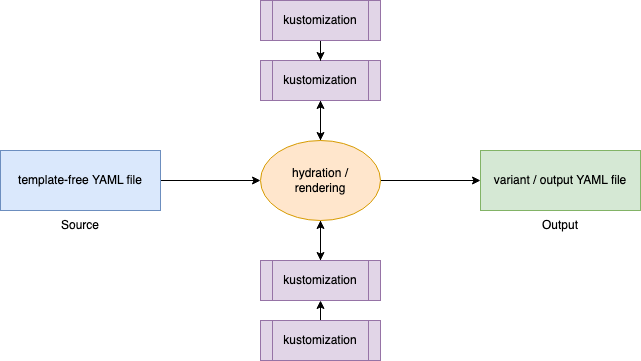

# What is Kustomize?

> Nav: [Back to Intro Lectures](../README.md)

Hello, Welcome to configuration management with Kustomize. 

Kustomize is a kubernetes configuration management tool that takes in raw template-free YAML, applies a kustomization using a process known as "hydration or rendering"
to produce variant YAML manifest files leaving the original YAML files untouched.

### Core Concepts:
- Template Free
- Purely Declarative
- Heavily Customizable 

But what does this mean? 

- Template Free: This means we can use raw original un-templated kubernetes manifest files all through! 
  No need to introduce additional complexity into our manifests. This keeps our original manifests files same and reusable.
  Kustomize aims for a completely template free source and output manifest files. You give it template-free YAML, and it produces template-free yaml.

- Purely Declarative: Tell it what you want and it goes and gets it done. Its like that assistant that just gets you. 
  It abstracts away the complexities of what needs to be done and gives you a ready to use output YAML file based on your requests.

- Heavily Customizable: Kustomize is customizable. That is evident in the name. With template-free yaml, we can now isolate common functionality in our configuration as a base and 
  reuse them across variants of our application without having to repeat ourselves.
  Also, Kustomize is built for the Kubernetes API. This means it can modify almost any kubernetes style API objects and also supports a plugin framework to extend its functionality for your specific use case.

Imagine you need to make a few mugs (3 or more). For each mug, let's assume you will need
- Ceramic
- A Handle
- A lid, and
- Acrylic paint 

The only difference between these 3 mugs are their colors (Red, Blue and Green). The following diagram illustrates what this process looks like without and with Kustomize.

With Kustomize, all we need to create a new mug is a paint of the color we need.
Now, assuming our customer comes in the next day and says, they don't want a handle with the mug, In option A (without Kustomize), we will need to remove the handle on the 3 mugs!
With option B (Kustomize), all we need is remove the handle from our "Base" mug and all other mugs that reference our base mug will reflect this.

> Nav: [Back to Intro Lectures](../README.md)

## Further reading

- https://kubectl.docs.kubernetes.io/guides/introduction/kustomize/
- 
